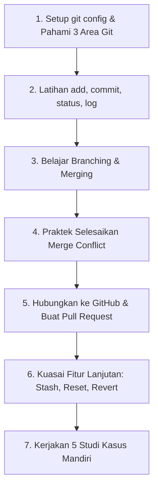

# 🚀 Panduan & Modul Latihan Git & GitHub Lengkap

Selamat datang di repositori latihan Git dan GitHub! Repositori ini telah disusun secara terstruktur untuk membantu Anda memahami, melatih, dan menguasai Git dari level pemula (dasar) hingga tingkat lanjut (kolaborasi tim dan industri).

---

## 📚 Daftar Isi Materi

| Modul | Judul Materi | Deskripsi Singkat |
| :--- | :--- | :--- |
| **[Modul 01](materi/01-pengenalan-dan-instalasi.md)** | **Pengenalan & Konfigurasi** | Memahami VCS, perbedaan Git vs GitHub, 3 area Git, dan setup awal (`git config`). |
| **[Modul 02](materi/02-perintah-dasar-git.md)** | **Perintah Dasar Git** | `init`, `status`, `add`, `commit`, `log`, `diff`, serta standar pesan commit. |
| **[Modul 03](materi/03-branching-dan-merging.md)** | **Branching & Merging** | Membuat percabangan, beralih branch, dan menggabungkan kode (`Fast-forward` vs `3-Way`). |
| **[Modul 04](materi/04-simulasi-merge-conflict.md)** | **Menangani Merge Conflict** | Panduan simulasi membuat konflik secara sengaja dan cara menyelesaikannya. |
| **[Modul 05](materi/05-kolaborasi-dengan-github.md)** | **Kolaborasi & Remote GitHub** | `remote`, `push`, `pull`, `fetch`, `clone`, serta alur Pull Request (PR). |
| **[Modul 06](materi/06-fitur-lanjutan-git.md)** | **Fitur Lanjutan & Undo** | `git stash`, `git reset`, `git revert`, `git restore`, dan `.gitignore`. |
| **[Modul 07](materi/07-git-cheatsheet.md)** | **Git Cheatsheet & Troubleshooting** | Tabel contekan cepat dan solusi masalah yang sering dihadapi developer. |
| **[Praktik](latihan/STUDI_KASUS.md)** | **5 Studi Kasus / Skenario Latihan** | Latihan simulasi nyata: Hotfix, Feature branch, Resolve Conflict, dan Kolaborasi. |

---

## 🗺️ Roadmap Belajar yang Disarankan



---

## 🛠️ Persiapan Awal

Sebelum mulai membaca materi, pastikan Git sudah terpasang di komputer Anda. Buka terminal lalu jalankan:

```bash
git --version
```

Jika versinya muncul (misal: `git version 2.x.x`), Anda siap memulai! Silakan buka **[Modul 01: Pengenalan dan Konfigurasi](materi/01-pengenalan-dan-instalasi.md)** untuk mulai belajar.

