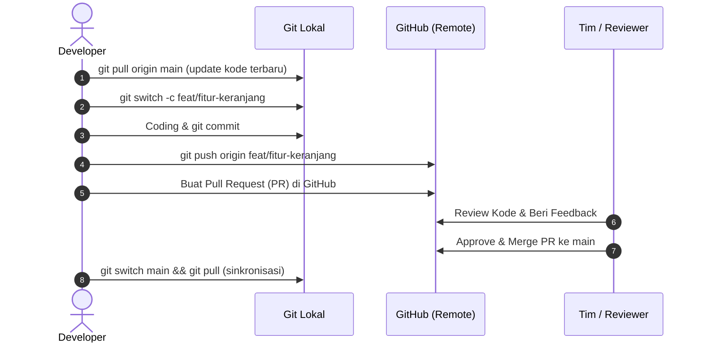

# Modul 05: Kolaborasi dengan GitHub

Setelah memahami Git di komputer lokal Anda, sekarang kita akan menghubungkannya ke **GitHub** untuk keperluan backup di cloud dan kolaborasi bersama tim / komunitas open source.

---

## 1. Menghubungkan Repository Lokal ke GitHub

Jika Anda sudah memiliki repository di komputer dan ingin mengunggahnya ke GitHub:

### Langkah 1: Buat Repo di GitHub
1. Buka [github.com](https://github.com) dan login.
2. Klik tombol **"+"** di pojok kanan atas -> **New repository**.
3. Beri nama repository (misal: `latihan-git`).
4. Biarkan opsi *"Add a README file"*, *".gitignore"*, dan *"License"* **tidak dicentang** (karena kita sudah punya file lokal).
5. Klik **Create repository**.

### Langkah 2: Hubungkan Remote URL
Salin URL repository dari GitHub, lalu jalankan di terminal:

```bash
# Menambahkan remote dengan alias 'origin'
git remote add origin https://github.com/USERNAME-ANDA/latihan-git.git

# Memeriksa remote yang terdaftar
git remote -v
```

### Langkah 3: Push Pertama Kali
```bash
# Memastikan nama branch adalah main
git branch -M main

# Mengunggah branch main ke origin dan menyetel upstream (-u)
git push -u origin main
```
> *Catatan:* Opsi `-u` (set-upstream) berfungsi agar ke depannya Anda cukup mengetik `git push` atau `git pull` saja tanpa harus mengetik `origin main`.

---

## 2. Mengambil Proyek Orang Lain (`git clone`)

Jika proyek sudah ada di GitHub dan Anda ingin mengunduhnya ke komputer baru:

```bash
git clone https://github.com/USERNAME/NAMA-REPO.git
cd NAMA-REPO
```

---

## 3. Sinkronisasi: Push, Fetch, dan Pull

- **`git push`**: Mengirimkan commit dari komputer lokal Anda ke GitHub.
- **`git fetch`**: Memeriksa perubahan baru di GitHub tanpa langsung menggabungkannya ke kode lokal Anda (aman untuk inspeksi).
- **`git pull`**: Mengambil perubahan terbaru dari GitHub dan langsung menggabungkannya (*fetch + merge*) ke branch lokal Anda saat ini.

```bash
# Selalu biasakan pull sebelum mulai bekerja setiap hari!
git pull origin main
```

---

## 4. Alur Kerja Standar Industri (GitHub Flow)

Inilah alur kerja yang dipakai oleh software engineer profesional:



### Apa itu Pull Request (PR)?
Pull Request adalah permintaan formal kepada pemilik/tim proyek untuk meninjau (*code review*) dan menggabungkan perubahan yang Anda buat di branch Anda ke branch utama (`main`). Di dalam PR, rekan tim dapat memberi komentar per baris kode, menyarankan perbaikan, dan menjalankan automated test (CI/CD).

---

## 5. Konsep Forking (Untuk Kontribusi Open Source)

Jika Anda ingin berkontribusi ke proyek publik yang bukan milik Anda dan Anda tidak memiliki akses tulis (write access):
1. **Fork**: Klik tombol **Fork** di GitHub untuk menggandakan repositori tersebut ke akun GitHub pribadi Anda.
2. **Clone**: Clone repository hasil fork tersebut ke komputer Anda.
3. **Branch & Commit**: Buat branch baru dan lakukan perubahan.
4. **Push**: Push branch ke repository hasil fork Anda.
5. **Open PR**: Buat Pull Request dari repo Anda menuju repositori asli (*upstream*).

---

➡️ Lanjut ke: **[Modul 06: Fitur Lanjutan & Undo Perubahan](06-fitur-lanjutan-git.md)**

